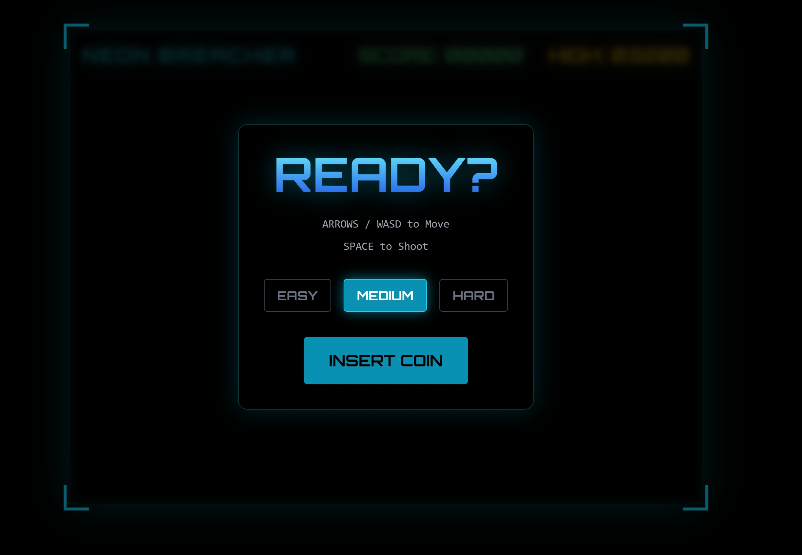
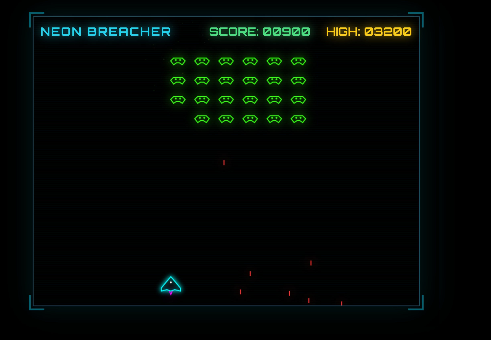
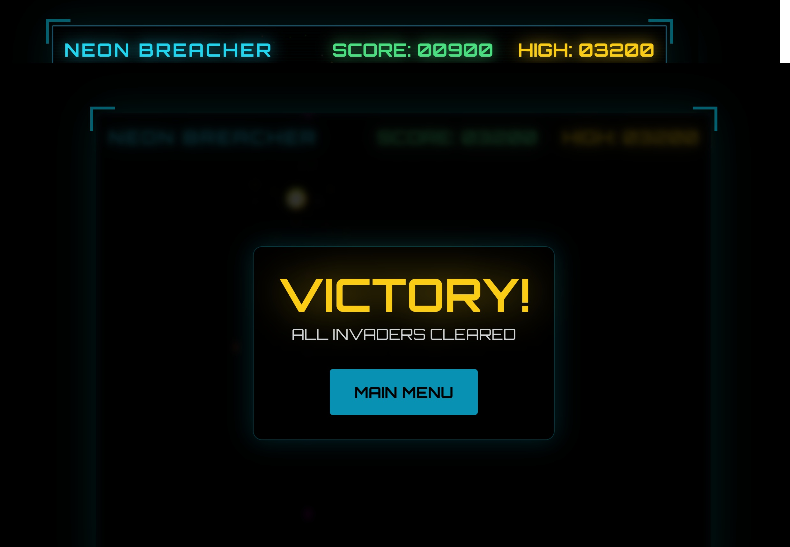

# Neon Breacher - Retro Arcade Experience



Neon Breacher is a high-performance, retro-futuristic arcade shooter built to demonstrate modern web rendering techniques. It combines the reactive state management of **React** for UI with a raw **HTML5 Canvas** engine for gameplay, ensuring 60+ FPS performance with zero external asset dependencies.

This project explores the "Zero-Asset" philosophy—every visual element is drawn programmatically via Canvas vectors, and every sound effect is synthesized in real-time using the Web Audio API.

## Features

  * **Hybrid Rendering Engine:** Decouples the React UI layer (HUD, Menus) from the Imperative Game Loop (Canvas), ensuring complex UI state updates never cause frame drops in the gameplay.
  * **Real-Time Audio Synthesis:** No `.mp3` or `.wav` files. A custom `SoundManager` class uses browser Oscillators (Square and Sawtooth waves) to generate retro sound effects on the fly.
  * **Procedural Particle System:** Features a lightweight physics particle engine for explosions and thrust effects, handling hundreds of entities with object pooling optimization.
  * **Frame-Rate Independence:** The game loop calculates physics based on Delta Time (`dt`), ensuring consistent game speed across 60Hz, 120Hz, and 144Hz monitors.



## Technical Architecture

Neon Breacher is architected to showcase clean separation of concerns between Declarative UI and Imperative Game Logic.

**1. The Hybrid Loop**
React is excellent for UI but poor for high-frequency game loops (due to Re-renders). This project uses a `useRef` hook to persist a `GameEngine` class instance. React handles the "Meta-State" (Start Screen, Game Over, High Scores), while the `GameEngine` class takes full control of the Canvas Context for the gameplay loop via `requestAnimationFrame`.

**2. Web Audio API Implementation**
Instead of loading static assets, the `SoundManager` creates ephemeral audio nodes.

  * **Shooting:** Generates a high-frequency Square wave with a rapid exponential decay envelope.
  * **Explosions:** Generates a low-frequency Sawtooth wave mixed with gain manipulation to simulate "crunchy" retro impacts.

**3. Type-Safe Entity Management**
Built entirely in **TypeScript**, the game enforces strict interfaces for all entities (`Player`, `Enemy`, `Bullet`). This prevents common runtime errors associated with dynamic collision detection and entity state updates.

## Tech Stack

**Core Engine**

  * **HTML5 Canvas API:** Hardware-accelerated 2D rendering.
  * **TypeScript:** Strict typing for game logic and physics calculations.
  * **Web Audio API:** Real-time sound synthesis.

**Application Framework**

  * **React 19:** Component-based UI architecture.
  * **Vite:** High-speed build tool and dev server.
  * **Tailwind CSS:** Utility-first styling for the overlay UI.



## Prerequisites

To run this project locally, you need:

1.  Node.js (Version 18 or higher)
2.  npm (Node Package Manager)

## Getting Started

Follow these steps to set up the local development environment.

**1. Clone the repository**

```bash
git clone https://github.com/Manuele-T/neon-breacher
cd neon-breacher
```

**2. Install Dependencies**

```bash
npm install
```

**3. Run Development Server**

```bash
npm run dev
```

## Project Structure

```
├── src
│   ├── components
│   │   └── NeonInvaders.tsx    # React UI Wrapper & Canvas Ref
│   ├── game
│   │   ├── GameEngine.ts       # Core Physics & Rendering Loop
│   │   └── SoundManager.ts     # Web Audio API Synthesizer
│   ├── types.ts                # TypeScript Interfaces
│   ├── App.tsx                 # Root Component
│   └── main.tsx                # Entry Point
├── public
├── screenshots                 # Demo Images
├── index.html
├── package.json
├── tailwind.config.js
├── tsconfig.json
└── vite.config.ts
```